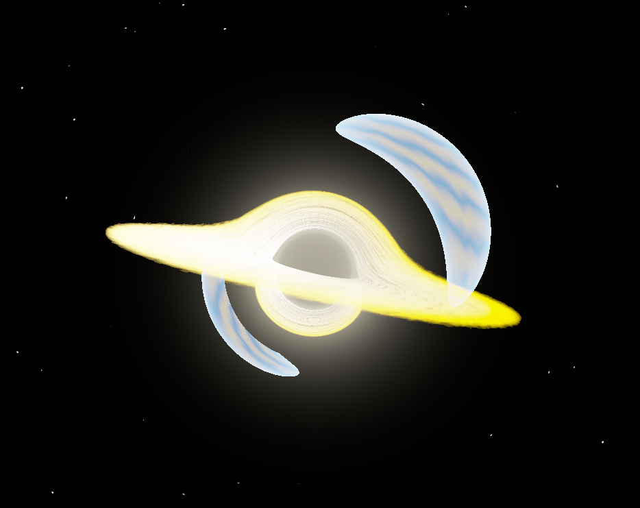

# WebGPU General Relativity Black Hole Raytracer

A real-time, interactive WebGPU volumetric raytracer that simulates the physics of a Schwarzschild black hole, general relativistic light bending (geodesics), Doppler beaming, gravitational redshift, and a multi-scale turbulent accretion disk.



## Features

- **General Relativity Geodesic Bending**: Accurate numerical integration of light paths in a Schwarzschild metric using WebGPU fragment shaders.
- **Volumetric Accretion Disk**:
  - Multi-scale 3D Fractal Brownian Motion (FBM) with domain warping for realistic fluid-like gas dynamics.
  - Ridged noise functions creating high-contrast, clumpy gas filaments and tendrils.
  - Relativistic Doppler beaming and gravitational redshift effects.
- **Planckian Blackbody Radiation**: Dynamic color shifting (from warm amber/orange to scorching blue-white) based on local disk temperature and ISCO proximity.
- **Dynamic Adaptive Step Sizing & Ray Dithering**: Sub-pixel dithering eliminates concentric step-size interference (vinyl/turbofan artifacts) while maintaining sub-step accuracy near the photon sphere ($r = 1.5 r_s$).
- **Background Lensed Planet**: Real-time rendering of a lensed background gas giant orbiting the system.
- **Filmic Tonemapping**: Extended dynamic range (HDR) color accumulation with Reinhard tonemapping.

## Prerequisites & Setup

Ensure you are using a modern browser with **WebGPU support** enabled (Chrome 113+, Edge 113+, or Firefox/Safari with WebGPU flags enabled).

- Clone the repository:

```bash
git clone [https://github.com/cammythekitty/webgpu-blackhole.git](https://github.com/cammythekitty/webgpu-blackhole.git)
cd webgpu-blackhole
cargo run --release
wasm-pack build --target web
```